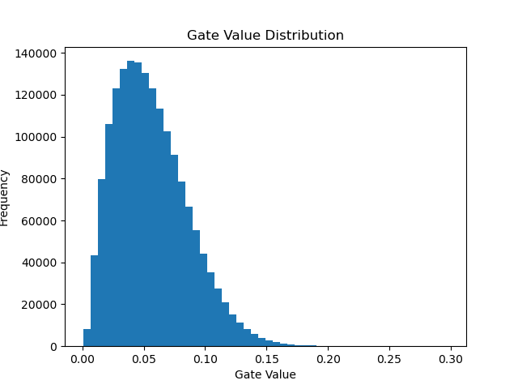

# Self-Pruning Neural Network (Tredence Case Study)

## Overview
This project implements a neural network that learns to prune itself during training using learnable gates and L1 regularization. Instead of pruning weights after training, the model dynamically identifies and suppresses less important connections during the training process itself.

---

## Approach
Each weight in the network is associated with a learnable gate:

W' = W × sigmoid(G)

Where:
- W = original weight  
- G = learnable gate score  
- sigmoid(G) ∈ (0,1) controls the contribution of each weight  

If a gate value approaches 0, the corresponding weight is effectively pruned.

---

## Why L1 on Gates Encourages Sparsity

The L1 regularization term penalizes the sum of gate values. Since gate values lie between 0 and 1 (after applying sigmoid), minimizing this term encourages many gates to move toward 0.

As a result:
- Gates close to 0 suppress corresponding weights  
- Only important connections retain higher gate values  

This leads to a sparse network where unnecessary weights are removed during training.

---

## Results

| Lambda | Accuracy | Sparsity |
|--------|----------|----------|
| 0.001  | 54.25%   | 1.71%    |
| 0.01   | 51.96%   | 1.72%    |
| 0.1    | 50.42%   | 1.72%    |

---

## Observations

- Model accuracy decreases slightly as lambda increases  
- Sparsity remains very low across all lambda values  
- The lack of sparsity variation suggests that the L1 penalty is not strong enough relative to the classification loss  
- This indicates the need for proper scaling or normalization of the sparsity loss term  

---

## Gate Distribution

### Interpretation

- Most gate values are concentrated away from zero  
- Very few gates are close to 0, indicating minimal pruning  
- The distribution does not show a strong spike at 0  

This confirms that the model is not effectively learning sparsity under the current setup.

**Expected Behavior (Ideal Case):**
- A strong spike near 0 (pruned weights)  
- A separate cluster of higher values (important weights)  

---

## How to Run

Install dependencies:

pip install -r requirements.txt  

Run training:

python train.py  

---

## Key Insights

- L1 regularization alone may not be sufficient without proper scaling  
- Balancing classification loss and sparsity loss is critical  
- Model architecture and training duration impact pruning effectiveness  
- Proper normalization of sparsity loss is necessary for meaningful pruning  

---

## Future Improvements

- Apply scaling/normalization to sparsity loss  
- Increase training epochs for better convergence  
- Extend approach to CNN architectures for better performance  
- Implement hard threshold pruning for real inference speedup  
- Explore advanced pruning techniques (e.g., hard concrete gates)  

---

## Conclusion

This project demonstrates a self-pruning neural network architecture where sparsity is learned during training. While the current implementation shows limited pruning, it highlights the importance of loss balancing and provides a strong foundation for further optimization and real-world deployment.
